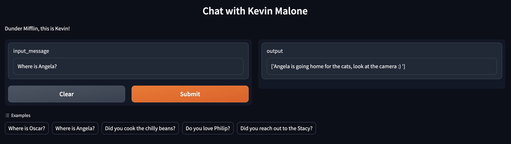
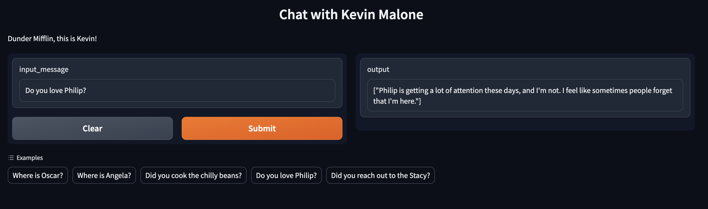
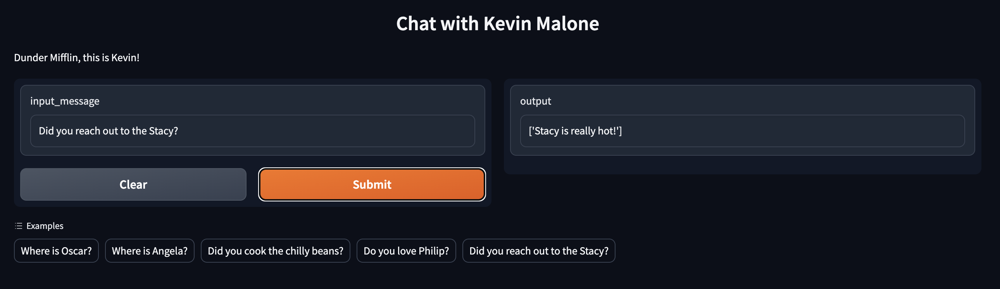

# Chat with Kevin Malone
This project is to build up a Chat App with the chatGPT API. 
The app will then be demoed with the help of gradio.
The theme of this app is based on the character Kevin Malone from the TV show The Office.

## Usage Instructions
Run the code, and then go to the link provided by gradio.

## Demo
- Ask Kevin anything about Angela, and he will respond with a scene from the show.

- Ask Kevin anything about Philip, and he will respond with a quote from the show.

- Ask Kevin anything about Stacy, and he will respond as he is Kevin.

## References
[Sentdex - ChatGPT-API-Basics](https://github.com/Sentdex/ChatGPT-API-Basics)
